# Open5GS Network Management System (NMS)

[](https://www.gnu.org/licenses/agpl-3.0)
[](https://www.docker.com/)
[](https://open5gs.org/)
[](https://nodejs.org/)
[](https://reactjs.org/)

Web-based management system for Open5GS 5G Core and 4G EPC networks. Provides complete configuration management, real-time monitoring, subscriber provisioning, and network visualization through an intuitive interface. Please be aware this project is heavily AI-assisted. If you find any issues please let me know — I will fix them as fast as I can.

---

## 🎯 Overview

Open5GS NMS simplifies the management of Open5GS deployments by providing:

- **Complete Network Function Management** - Configure all 16 Open5GS network functions (5G Core + 4G EPC)
- **Visual Network Topology** - Interactive real-time visualization of your network infrastructure
- **Subscriber Management** - Full CRUD operations with SIM generator and auto-provisioning
- **Real-Time Monitoring** - Live service status, logs, and active session tracking
- **Safe Configuration** - Automatic backups, validation, and rollback on failure
- **5G Privacy (SUCI)** - Home network key management for subscription concealment
- **Authentication** - Session-based login protecting all pages and API endpoints


---

## ✨ Key Features

### Authentication
- **Login required** — All pages and API endpoints are protected. A login form is shown automatically to unauthenticated users
- **Session persistence** — Sessions survive page refresh (24-hour lifetime by default, configurable)
- **Secure cookies** — HttpOnly, SameSite=lax; `Secure` flag enabled when behind HTTPS
- **First-run setup** — Admin account created automatically on first deploy (see [First Login](#first-login))
- **Brute force protection** — Login endpoint rate-limited to 10 attempts per 15 minutes per IP

### Metrics & Monitoring
- **Prometheus Integration** — Prometheus scrape config auto-generated and live-reloaded on every config apply. No manual `prometheus.yml` editing needed
- **Grafana Dashboards** — Pre-built Open5GS dashboard covering AMF, SMF, UPF, PCF, HSS, PCRF and process health. Grafana datasource auto-provisioned on first start
- **Metrics Endpoints Page** — Dual-mode editor: table view for individual NF address/port editing, or direct Prometheus scrape config YAML editing. Both views stay in sync
- **One-click access** — Prometheus and Grafana links directly in the Metrics page header


### Configuration Management
- **Dual Editor Modes** - Form-based editor with 150+ contextual tooltips OR Monaco YAML editor
- **All 16 Network Functions** - Complete coverage: NRF, SCP, AMF, SMF, UPF, AUSF, UDM, UDR, PCF, NSSF, BSF (5G) + MME, HSS, PCRF, SGW-C, SGW-U (4G)
- **Real-Time Validation** - Zod schema validation with cross-service dependency checking
- **Safe Apply Workflow** - Automatic backups, ordered service restarts, automatic rollback on failure
- **YAML Preservation** - Maintains comments, formatting, and structure


### RAN Network Monitoring
- **4G EPC section** — S1-MME (control plane) and S1-U (user plane) interface cards with live connected eNodeB IPs
- **5G NR section** — N2 (AMF ↔ gNodeB) and N3 (UPF ↔ gNodeB) interface cards with live connected gNodeB IPs
- **UE-to-radio mapping** — each radio card shows which UEs are connected to it (IMSI, UE IP, CM State) nested directly under the radio row
- **Active UE Sessions table** — combined 4G + 5G sessions with Generation, CM State, DNN/APN, Security algorithms, AMBR, and Radio IP columns
- **True 4G/5G separation** — sourced directly from Open5GS internal APIs (AMF, MME, SMF) — no packet capture needed
- All interface IPs sourced from Open5GS YAML configs — no hardcoded addresses


### Network Topology Visualization
- **Interactive Diagram** - JointJS-based professional network topology
- **Real-Time Status** - Color-coded service indicators (green=active, red=inactive)
- **5G Radio Network Status box** — live N2 and N3 gNodeB IPs on the topology canvas
- **Active 5G UE Sessions box** — UE IP + IMSI pairs sourced from Open5GS AMF/SMF APIs
- **Active 4G UE Sessions box** — UE IP + IMSI pairs sourced from Open5GS MME API
- **Professional Layout** - Manual routing with 90-degree orthogonal connectors

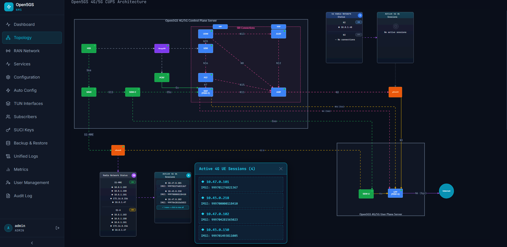

### Service Management
- **Real-Time Monitoring** — WebSocket-based live status cards for all 16 NFs plus MongoDB
- **Systemd Integration** — Start, stop, restart, enable and disable services directly from the UI
- **Bulk Operations** — Control all services at once in correct dependency order
- **MongoDB tracking** — MongoDB included as a first-class service with status indicator on topology


### Auto-Configuration Wizard
- **One-Click Setup** — Generate all 16 NF configurations from minimal input (PLMN, host IPs, UE subnets)
- **Preview Changes** — YAML diff viewer shows exact changes before applying
- **Persistent NAT** — iptables rules saved via `netfilter-persistent` and IP forwarding via `sysctl.d` — survive reboots


### Backup & Restore
- **Automatic Backups** — Created before every configuration change; configurable retention policy
- **Selective Restore** — Restore config only, database only, both, or specific NFs
- **Rollback Protection** — Automatic restore on service restart failure
- **Diff Viewer** — Compare any backup against current config before restoring
- **Factory Defaults** — One-click restore to stock Open5GS configuration


### Femtocell Provisioning (Sercomm SCE4255W)
- **Auto-credential derivation** — derives root SSH and WebUI passwords from MAC address using the calc_f2 algorithm
- **Auto-config pull** — detects if WebUI is already enabled and pulls current config into the form automatically
- **Full provisioning** — enables WebUI via SSH if needed, applies all radio and core config, reboots device
- **CBRS Band 48 defaults** — pre-filled for dual-carrier deployment
- **MME IP auto-populated** from your Open5GS configuration
- **Browser geolocation** for SAS lat/long coordinates

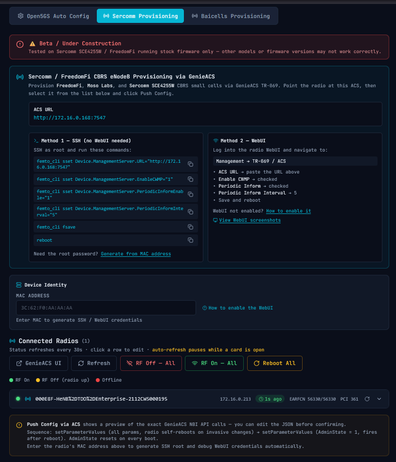

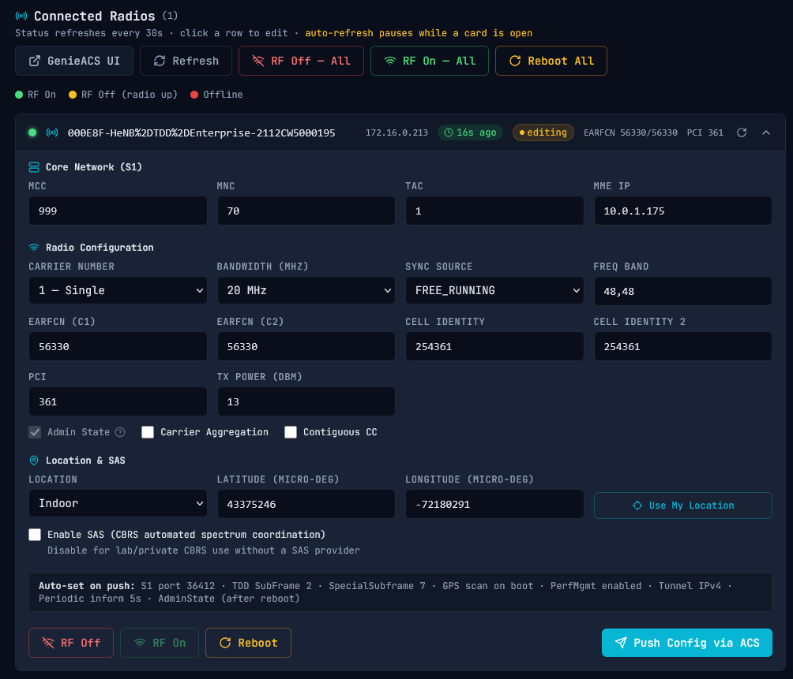

### CBRS SAS Server (Citizens Broadband Radio Service)
- **Built-in SAS** — full FCC-compliant Spectrum Access System for CBRS Band 48 (3.5 GHz) deployments, no third-party SAS subscription required
- **Multi-radio support** — deterministic per-CBSD channel assignment based on serial number sort order; race-condition-proof, survives re-registrations and Clear DB cycles
- **Interference coordination groups** — radios in the same group are automatically spread across non-overlapping 20 MHz slots
- **Multi-site scaling** — independent slot assignment per interference group; two sites can reuse the same frequencies without conflict
- **Spectrum chart** — visual frequency band display with color-coded slots, EARFCN labels, and per-CBSD assignment table
- **GPS delay enforcement** — configurable lock delay (default 75 s) before grants are issued, ensuring radios are GPS-locked before transmitting
- **Pause / Resume** — instantly stops all SAS responses (radios return DEREGISTER and go silent) without deleting any data
- **Clear DB** — wipes all grants and CBSDs in one click for testing; radios re-register and get fresh deterministic slot assignments on reboot
- **CBRS SAS protocol** — implements the WInnForum CBRS SAS-CBSD interface (registration, spectrumInquiry, grant, heartbeat, relinquishment, deregistration)
- **Baicells TR-069 integration** — full SAS parameter provisioning via GenieACS ACS on the Baicells provisioning page

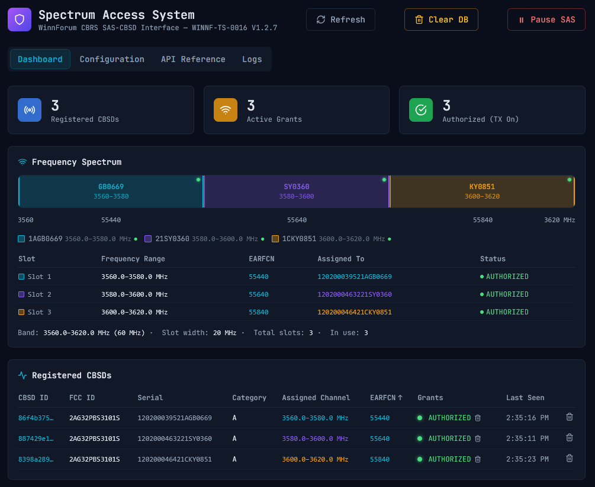

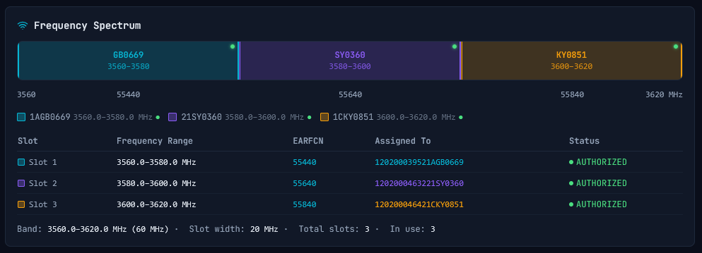

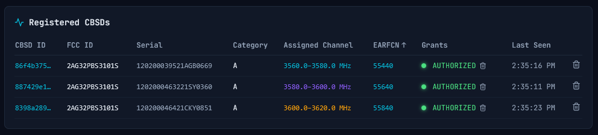

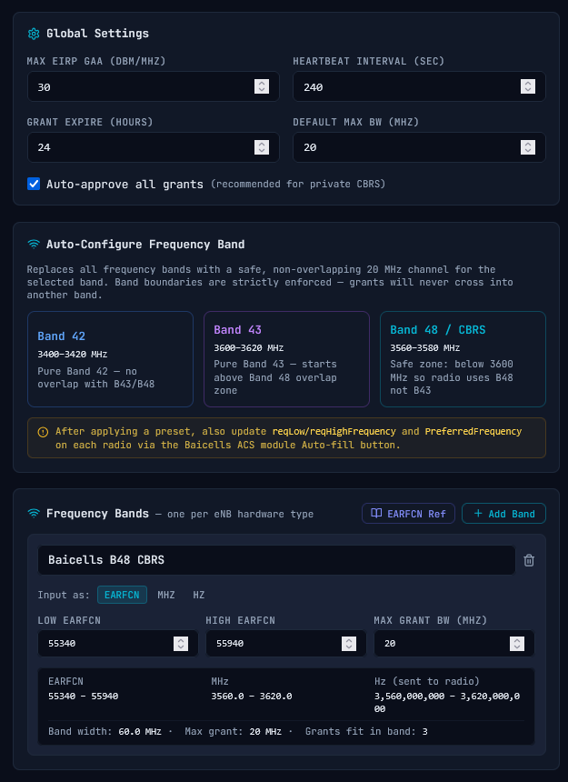

### Baicells eNodeB Provisioning *(Beta)*
- **GenieACS TR-069 ACS integration** — radios register automatically via CWMP on port 7547
- **Live RF status** — per-radio status dot (green = RF on, amber = RF off, red = offline) with 30-second auto-refresh
- **Full config push** — all parameters sent in a single TR-069 session, followed by automatic reboot and RF enable
- **Editable confirm modal** — preview the exact GenieACS NBI API calls before anything is sent; edit the JSON if needed
- **Per-radio and global controls** — Enable RF, Disable RF, Reboot per radio; RF On All, RF Off All, Reboot All from the header
- **Auto-backup** — full device parameter snapshot saved to disk after every successful provision
- **Audit logging** — all provision, reboot, and RF actions logged
- **Tested on:** Baicells Nova 430i running BaiBLQ_3.0.12 firmware

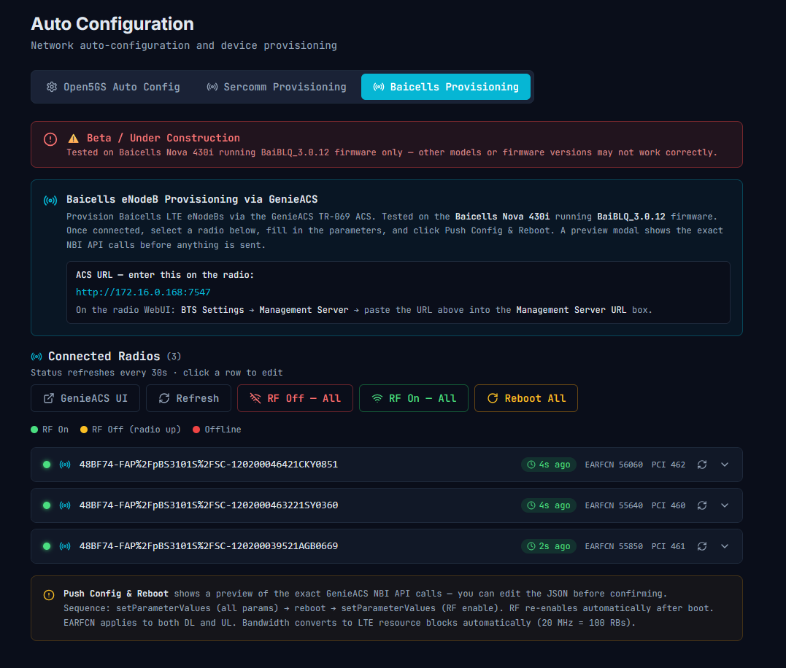

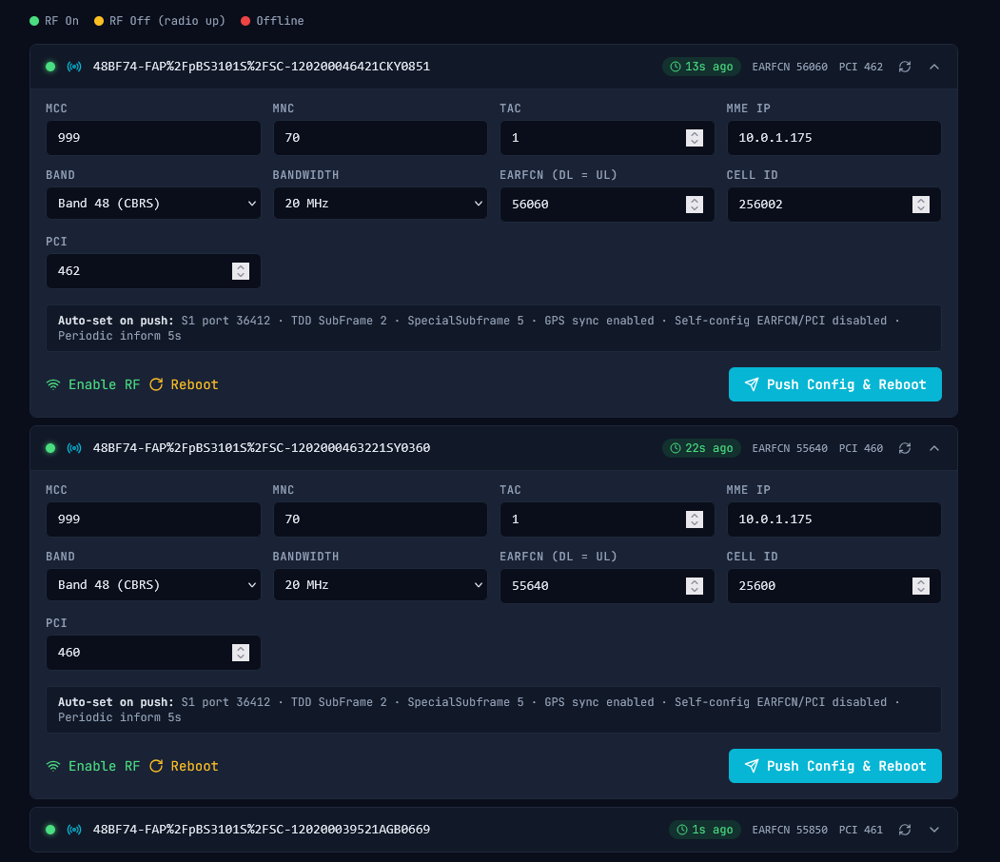

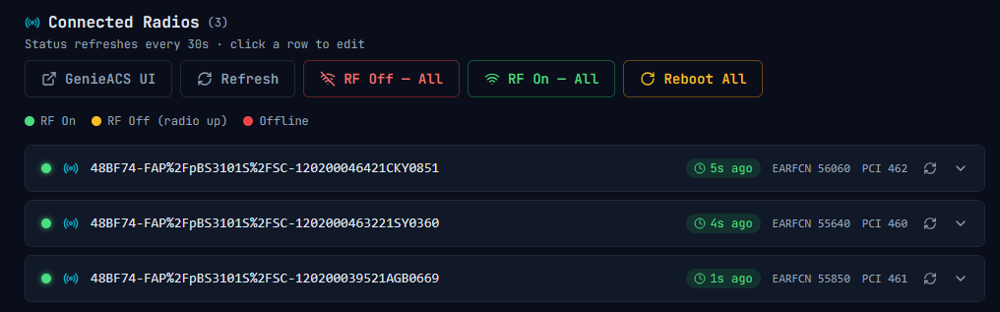

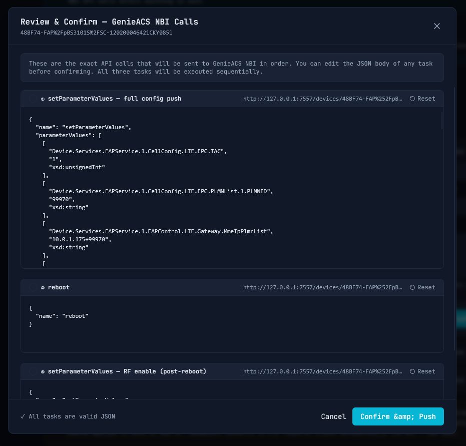

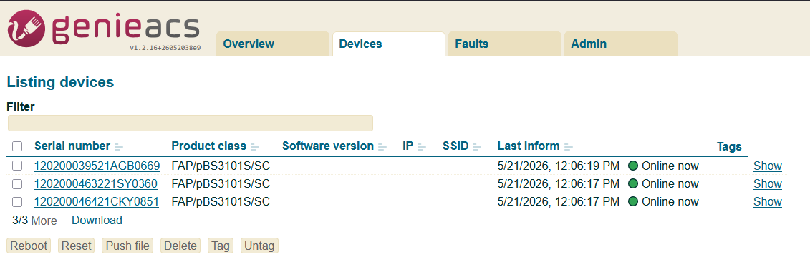

### SUCI Key Management (5G Privacy)
- **Keypair Generation** — Create X25519 (Profile A) or secp256r1 (Profile B) home network keys
- **Public Key Display** — Hex format ready for eSIM provisioning
- **pySIM JSON Generator** — One-click generation of correctly formatted `EF.SUCI_Calc_Info` JSON for pySIM-shell, in both pretty and single-line formats
- **Automatic Configuration** — Updates UDM config with new public key on generate/rotate
- **PKI Management** — Support for multiple PKI values (0–255) with next-ID auto-suggestion, rename without destroying keys


### Subscriber Management
- **Full CRUD Operations** - Create, read, update, delete subscribers via MongoDB
- **SIM Generator** - Generate test SIM credentials with country-based MCC selection (65+ countries)
- **Auto-Provisioning** - Automatically add generated SIMs to Open5GS database
- **Multi-Slice Support** - Configure multiple network slices and sessions per subscriber
- **Search & Pagination** - Efficient browsing of large subscriber databases


### Real-Time Logging
- **Dual Log Sources** — Stream logs from Open5GS systemd services OR Docker containers
- **Live Log Streaming** — Tail logs from any service via WebSocket
- **Service Filtering** — Multi-select services or containers to monitor simultaneously


---

## 🚀 Quick Start

### Prerequisites

- **Ubuntu 24.04 LTS** (or compatible Linux distribution)
- **Open5GS 2.7+** installed and configured
- **MongoDB 6.0+** running on localhost
- **Docker Engine 24.0+** and **Docker Compose v2.20+**

### Installation

```bash
# Clone the repository
git clone https://github.com/paulmataruso/open5gs-nms
cd open5gs-nms

# Configure environment (required — see Authentication section below)
cp .env.example .env
nano .env

# Build and start all services
docker compose up --build -d

# Access the web interface
open http://YOUR_SERVER_IP:8888
```

For detailed installation instructions, see **[INSTALL.md](INSTALL.md)**.

---

## 🔐 Authentication

### First Login

On first startup, an admin account is created automatically.

**Option A — Set your own password (recommended):**

Add this to your `.env` before running `docker compose up`:

```bash
FIRST_RUN_PASSWORD=your-secure-password-here
```

Then log in with username `admin` and the password you set. Clear `FIRST_RUN_PASSWORD` from `.env` after your first login.

**Option B — Auto-generated password:**

Leave `FIRST_RUN_PASSWORD` empty. A random password is generated and printed once to the container logs:

```bash
docker logs open5gs-nms-backend 2>&1 | grep -A4 "FIRST RUN"
```

Expected output:
```
════════════════════════════════════════════════════
  FIRST RUN — Admin account created
  Username : admin
  Password : Xk7mQ2pL9nRv4wYa
  Change this password after first login!
════════════════════════════════════════════════════
```

> **Missed the password?** Delete the auth database and restart:
> ```bash
> docker compose down && rm -f ./data/auth.db && docker compose up -d
> ```

### Auth Configuration

| Variable | Default | Description |
|----------|---------|-------------|
| `FIRST_RUN_PASSWORD` | *(empty)* | Initial admin password. Auto-generated if empty. Clear after first login. |
| `SESSION_MAX_AGE` | `86400` | Session lifetime in seconds (default: 24 hours) |
| `COOKIE_SECURE` | `false` | Set to `true` **only** when serving over HTTPS. Setting this to `true` on plain HTTP silently breaks login. |
| `AUTH_DB_PATH` | `/app/data/auth.db` | Path to SQLite auth database inside container. Must match the `./data:/app/data` volume mount. |

### HTTPS Deployments

When running behind HTTPS (nginx + SSL), set `COOKIE_SECURE=true` in `.env`:

```bash
COOKIE_SECURE=true
```

See **[docs/deployment.md](docs/deployment.md)** for full nginx SSL configuration.

---

## 📋 System Requirements

### Minimum
- **CPU:** 2 cores
- **RAM:** 4GB
- **Disk:** 20GB free space

### Recommended
- **CPU:** 4 cores
- **RAM:** 8GB
- **Disk:** 50GB free space (for logs and backups)

### Network
- Static IP address or DHCP reservation recommended
- Port 8888 for web interface
- Internet access for Docker builds

For complete requirements, see **[docs/requirements.md](docs/requirements.md)**.

---

## 📖 Documentation

### Getting Started
- **[Installation Guide](INSTALL.md)** - Step-by-step installation instructions
- **[Configuration Guide](docs/configuration.md)** - Network function configuration reference

### User Guides
- **[Features Overview](docs/features.md)** - Detailed feature documentation
- **[Subscriber Management](docs/subscribers.md)** - Provisioning and SIM generation
- **[SUCI Key Management](docs/suci.md)** - 5G privacy configuration
- **[Backup & Restore](docs/backup.md)** - Data protection strategies

### Administration
- **[Deployment Guide](docs/deployment.md)** - Production deployment best practices
- **[Troubleshooting](docs/troubleshooting.md)** - Common issues and solutions
- **[API Reference](docs/api-reference.md)** - Backend REST API documentation

### Development
- **[Architecture](ARCHITECTURE.md)** - System design and component overview
- **[Development Guide](docs/development.md)** - Local development setup
- **[Contributing](CONTRIBUTING.md)** - How to contribute to the project

---

## 🏗️ Architecture

The Open5GS NMS follows a **Clean Architecture** pattern with clear separation of concerns:

```
┌─────────────────────────────────────────────────────────────┐
│  Browser (React 18 + TypeScript + JointJS)                  │
│  http://YOUR_SERVER:8888                                     │
└───────────────┬──────────────────┬──────────────────────────┘
                │ REST API         │ WebSocket
                ▼                  ▼
┌─────────────────────────────────────────────────────────────┐
│  nginx Reverse Proxy (Alpine)                                │
│  Proxies /api → backend:3001                                 │
│  Upgrades WebSocket → backend:3002                           │
└───────────────┬──────────────────┬──────────────────────────┘
                │                  │
                ▼                  ▼
┌─────────────────────────────────────────────────────────────┐
│  Backend (Node.js 20 + TypeScript + Express)                │
│  Clean Architecture: Domain → Application → Infrastructure   │
│  Auth: Lucia v3 sessions → SQLite (auth.db)                 │
│  Container: privileged, network_mode: host                   │
└─────┬──────────┬──────────┬───────────┬──────────────────┬─┘
      │          │          │           │                  │
      ▼          ▼          ▼           ▼                  ▼
 /etc/open5gs  systemd   MongoDB    auth.db           /var/log
 (bind mount)  (via dbus) (host:27017) (./data volume) (bind mount)
```

### Technology Stack

**Frontend:**
- React 18.2, TypeScript 5.3, Vite 5.0
- TailwindCSS 3.4, Zustand 4.4
- JointJS 3.7 (topology), Monaco Editor 4.6 (YAML)

**Backend:**
- Node.js 20 LTS, TypeScript 5.3, Express 4.18
- Lucia v3 (sessions), better-sqlite3 (auth DB), oslo (bcrypt)
- Zod 3.22 (validation), MongoDB Native Driver 6.3
- WebSocket (ws) 8.16, Pino 8.17 (logging)

**Infrastructure:**
- Docker + Docker Compose
- nginx (reverse proxy)
- systemd (service management)

For detailed architecture documentation, see **[ARCHITECTURE.md](ARCHITECTURE.md)**.

---

## 🔧 Configuration

The NMS is configured through environment variables. Copy `.env.example` to `.env` and customize:

```bash
# Authentication (review before first deploy)
FIRST_RUN_PASSWORD=your-password    # Initial admin password
SESSION_MAX_AGE=86400               # Session lifetime in seconds
COOKIE_SECURE=false                 # Set true only for HTTPS deployments

# Backend
PORT=3001
WS_PORT=3002
MONGODB_URI=mongodb://127.0.0.1:27017/open5gs
CONFIG_PATH=/etc/open5gs
LOG_LEVEL=info
HOST_SYSTEMCTL_PATH=/usr/bin/systemctl
```

Default values work for most deployments. For production, see **[docs/deployment.md](docs/deployment.md)**.

---

## 🛡️ Security

### What's protected
- All API endpoints require a valid session cookie
- Login is rate-limited (10 attempts / 15 min per IP)
- Passwords are bcrypt-hashed
- Session cookies are HttpOnly (not accessible to JavaScript)
- Auth data is stored in a separate SQLite database — the Open5GS MongoDB is never touched for auth

### Production recommendations

1. **Enable HTTPS** — Configure nginx SSL termination (Let's Encrypt) and set `COOKIE_SECURE=true` in `.env`
2. **Network restrictions** — Deploy behind a VPN or firewall for internet-exposed instances
3. **Regular backups** — Automate backup jobs and store copies off-site
4. **Monitoring** — Set up external monitoring (Prometheus, Grafana)

See **[docs/deployment.md](docs/deployment.md)** for detailed hardening guidance.

---

## 🤝 Contributing

We welcome contributions! Whether it's bug reports, feature requests, or code contributions, please see our **[Contributing Guide](CONTRIBUTING.md)**.

### Development Setup

```bash
# Clone repository
git clone https://github.com/paulmataruso/open5gs-nms
cd open5gs-nms

# Backend development
cd backend
npm install
npm run dev      # Runs on http://localhost:3001

# Frontend development (separate terminal)
cd frontend
npm install
npm run dev      # Runs on http://localhost:5173
```

For detailed development instructions, see **[docs/development.md](docs/development.md)**.

---

## 📝 Changelog

See **[CHANGELOG.md](CHANGELOG.md)** for a complete version history.

### Latest Release: v2.0-beta (2026-05-27)

**📡 CBRS SAS Server**
- Full built-in WInnForum SAS-CBSD protocol server (registration, spectrumInquiry, grant, heartbeat, relinquishment, deregistration)
- Deterministic per-CBSD channel assignment keyed by serial number — race-condition-proof, survives re-registrations and Clear DB cycles
- Interference coordination group support — radios in the same group auto-spread across non-overlapping 20 MHz slots
- Multi-site scaling — independent slot assignment per group; two sites can reuse frequencies without conflict
- GPS delay enforcement (75 s configurable) before grants issued
- Grants issued as AUTHORIZED immediately (no GRANTED→heartbeat→AUTHORIZED delay)
- Pause SAS / Resume SAS button — radios return DEREGISTER instantly, no data deleted
- Clear DB button — wipes all grants and CBSDs in one click for testing
- Spectrum chart — visual frequency band with color-coded slots, EARFCN labels, per-CBSD assignment table
- Baicells TR-069 full SAS parameter provisioning (reqLowFrequency, reqHighFrequency, PreferredFrequency, enableMode, FccId, groupId, groupType, MaxEIRP, LegacyMode, etc.)
- SAS admin REST API: `/sas/admin/reset`, `/sas/admin/pause`, `/sas/admin/resume`, `/sas/admin/status`, `/sas/admin/slots`

**📡 Baicells eNodeB Provisioning**
- Full Band 42/43/48 band selector with auto-fill defaults
- EARFCN dropdown per band with SAS mode awareness (EARFCN greyed in SAS mode 2, labeled `(SAS)`)
- EARFCN mismatch warning when configured EARFCN doesn't match expected SAS-assigned slot
- SAS mode 2 handling — EARFCN not pushed to radio in SAS mode 2 (radio tunes to SAS grant)
- RF enable sends task twice (queued + connection_request) to ensure immediate effect
- `rfStatus` correctly derived from `X_COM_RadioEnable AND opState`

**🔗 Remote UPF / SGW-U Architecture (4G + 5G Edge Deployments)**
- **Remote UPF generator** (UPF config page) — generates ready-to-deploy `upf.yaml` for edge sites; "Add to SMF & Apply" wires it into `smf.yaml` automatically
- **SMF config page** — full UPF routing table (DNN, TAC, eNodeB Cell ID, NR Cell ID selection criteria); local UPF labeled "same host"; routable address selector; routing destination badge on session pools
- **Remote SGW-U generator** (SGW-U config page) — mirrors UPF pattern; generates `sgwu.yaml` with SGW-C address and deployment steps
- **SGW-C config page** — full SGW-U routing table with TAC, APN, Cell ID (e_cell_id) selection criteria; local SGW-U labeled; routable PFCP server section
- TAC/APN/Cell ID routing criteria — all three SGW-U selection methods from Open5GS `sgwc.yaml` supported in both SGW-C editor and SGW-U generator
- "How it works" topology button on SMF and SGW-C pages — opens modal with full network diagram explaining Remote UPF/SGW-U architecture, IP requirements, and interface routing
- Network topology diagram (SVG) showing central site (AMF, MME, SMF, SGW-C) ↔ edge site (UPF, SGW-U) with all interface IPs, PFCP/N4/Gxc connections, N2/S1-MME control plane, N3/S1-U user plane

**⚙️ Auto-Config improvements**
- "Use Local UPF Only" checkbox (default checked) — hides PFCP addressing complexity for single-server deployments; auto-detects from existing config
- `mergePfcpServers()` helper — prevents duplicate IP entries in PFCP server lists across all services (SMF, UPF, SGW-C); also self-heals existing duplicates on next run
- `localUpfOnly` and `localSgwuOnly` flags — when set, forces loopback defaults (127.0.0.x) regardless of IP fields

**🧪 Unit Tests**
- 32 Jest unit tests for RAN UE session reporting covering: 4G/5G session detection, IMSI field variants (supi/imsi, prefixed/bare), UE deduplication, live eNodeB/gNodeB filter, Prometheus metrics fallback, interface status
- `parsePeerIP` helper tests (bracketed IPv4, IPv6, plain IP:port)
- 5G-only deployment short-circuit — skips all 4G logic when MME not running

**🐛 Bug Fixes**
- RAN page UE crash fix — `mmeUe.supi` null guard with fallback to `imsi` field for older Open5GS versions
- RAN page eNodeB filter relaxed — `setup_success: false` no longer drops all UEs from display
- RAN page N3/5G filter relaxed — shows UEs even when gNodeB `setup_success` is false
- Services page route order fix — `/all/:action` registered before `/:name/:action` in Express; fixes "Stop 4G" / "Stop 5G" buttons
- SGW-C and SGW-U metrics sections removed — neither service exposes a Prometheus metrics HTTP endpoint
- Duplicate PFCP server IP bug (auto-config) — entering a loopback address that already exists in the YAML no longer creates duplicate entries

---

## 📄 License

Copyright (C) 2026 Paul Mataruso

This project is licensed under the **GNU Affero General Public License v3.0 (AGPL-3.0)** — see the [LICENSE](LICENSE) file for details.

In plain terms:
- You are free to use, modify, and distribute this software
- If you run a modified version on a server and users interact with it over a network, you must make your modified source code available to those users under the same license
- Commercial use requires either compliance with AGPL-3.0 or a separate commercial license agreement with the copyright holder

For commercial licensing inquiries, open an issue or discussion on [GitHub](https://github.com/paulmataruso/open5gs-nms).

---

## 🙏 Acknowledgments

- **[Open5GS Project](https://open5gs.org/)** - The open-source 5G Core and EPC implementation
- **[Lucia Auth](https://lucia-auth.com/)** - Session management library
- **[JointJS](https://www.jointjs.com/)** - Professional diagramming library
- **[React](https://reactjs.org/)** and **[TypeScript](https://www.typescriptlang.org/)** communities

---

## 📞 Support

- **Documentation:** [docs/](docs/)
- **Installation Issues:** [INSTALL.md](INSTALL.md) → [docs/troubleshooting.md](docs/troubleshooting.md)
- **Bug Reports:** [GitHub Issues](https://github.com/paulmataruso/open5gs-nms/issues)
- **Feature Requests:** [GitHub Issues](https://github.com/paulmataruso/open5gs-nms/issues)
- **Discussions:** [GitHub Discussions](https://github.com/paulmataruso/open5gs-nms/discussions)

---

**Built with ❤️ for the Open5GS community**
