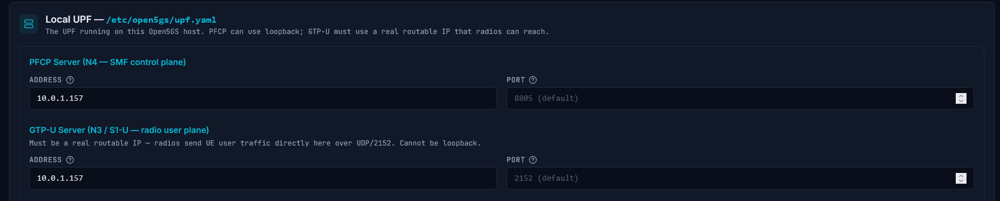
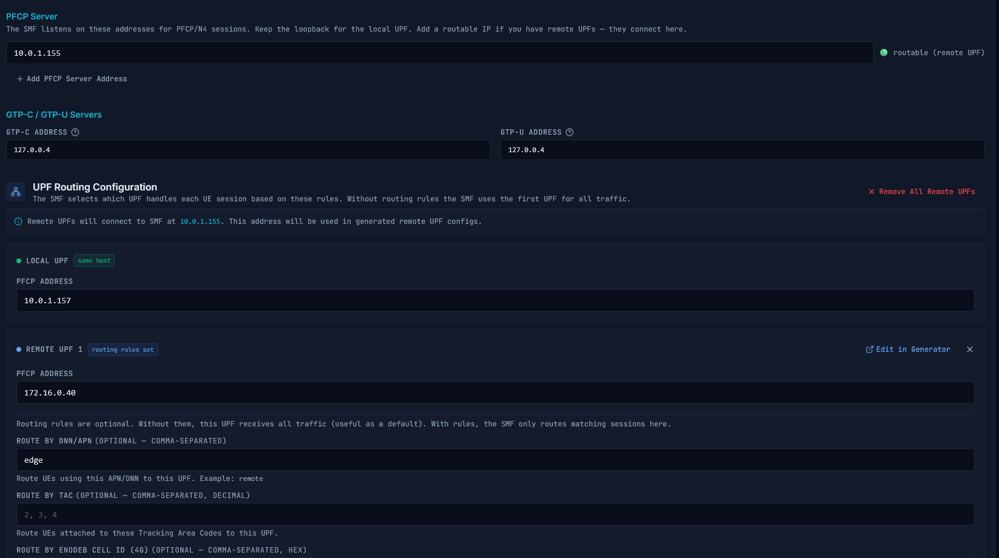
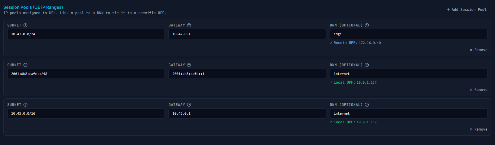
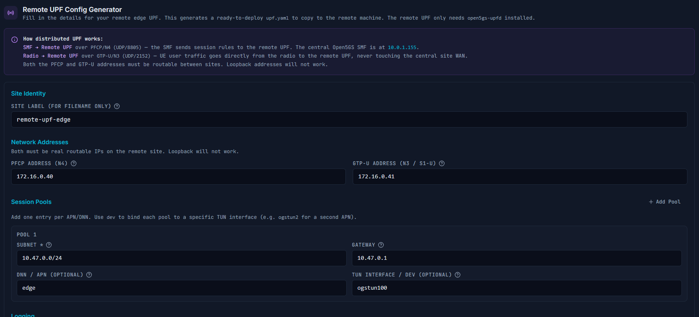
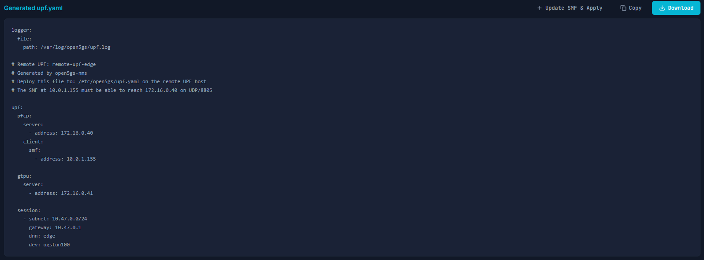

# Configuring a Remote UPF with open5gs-nms

This guide walks through adding a remote UPF (User Plane Function) to an existing Open5GS deployment using the open5gs-nms WebUI. A remote UPF allows you to offload a specific APN/DNN to a separate host at a remote site — useful for edge deployments, site-specific breakout, or separating traffic types.

---

## Overview

In this guide the central Open5GS core has the following routable IPs:

| IP | Role |
|---|---|
| `10.0.1.155` | 5G NGAP (N2), SMF PFCP/N4 server |
| `10.0.1.156` | 5G N3 GTP-U |
| `10.0.1.175` | 4G S1-MME (S1AP) |
| `10.0.1.176` | 4G S1-U GTP-U |
| `10.0.1.157` | Local UPF (PFCP + GTP-U) |

The remote UPF is at `172.16.0.40` (PFCP) and `172.16.0.41` (GTP-U), handling the `edge` APN with subnet `10.47.0.0/24`.

### Network diagram

```
                    ┌─────────────────────────────────────┐
                    │        Central Open5GS Core          │
                    │                                      │
  UE ── eNB/gNB ──► │  MME/AMF   SMF (10.0.1.155)         │
                    │              │         │             │
                    │              ▼         ▼             │
                    │  Local UPF (10.0.1.157)  ──► internet│
                    │  [APN: internet]                     │
                    └───────────────┬─────────────────────┘
                                    │ PFCP/N4 (UDP 8805)
                                    │ GTP-U (UDP 2152)
                                    ▼
                    ┌─────────────────────────────────────┐
                    │         Remote UPF (Edge Site)       │
                    │  172.16.0.40 (PFCP)                  │
                    │  172.16.0.41 (GTP-U)                 │
                    │  [APN: edge → 10.47.0.0/24]          │
                    └─────────────────────────────────────┘
```

---

## Prerequisites

- open5gs-nms deployed and working with at least one UE connecting on the `internet` APN
- A remote host with Ubuntu 22.04 or 24.04 that can reach `10.0.1.155` on UDP/8805 and UDP/2152
- The remote host has a routable IP for PFCP (`172.16.0.40`) and GTP-U (`172.16.0.41`)
- You know what APN/DNN and subnet the remote UPF will serve (e.g. `edge`, `10.47.0.0/24`)

---

## Step 1 — Give the Local UPF a Routable IP Address

By default, Open5GS UPF binds its PFCP interface to `127.0.0.7:8805` (loopback). This is fine when there is only one UPF. However, once you add a remote UPF, the SMF must also listen on a routable address (`10.0.1.155:8805`) so the remote UPF can reach it across the network.

**The problem:** If the local UPF stays on `127.0.0.7:8805` and the SMF moves to `10.0.1.155:8805`, two separate PFCP listeners are now operating on the same machine. But more importantly — the SMF's UPF client list needs to point to a **unique, routable** address for each UPF so it can distinguish them and route session establishment to the correct one. Two UPFs cannot share `127.0.0.7:8805` as their identity from the SMF's perspective.

**The fix:** Move the local UPF's PFCP and GTP-U addresses from `127.0.0.7` to a dedicated routable IP — in this case `10.0.1.157`.

### In the NMS

Navigate to **Config → UPF tab**.



Set:
- **PFCP Server Address** → `10.0.1.157`
- **GTP-U Server Address** → `10.0.1.157`

The resulting `upf.yaml` should look like this:

```yaml
upf:
  pfcp:
    server:
      - address: 10.0.1.157
    client: {}
  gtpu:
    server:
      - address: 10.0.1.157
  session:
    - subnet: 10.45.0.0/16
      gateway: 10.45.0.1
    - subnet: 2001:db8:cafe::/48
      gateway: 2001:db8:cafe::1
  metrics:
    server:
      - address: 127.0.0.7
        port: 9090
```

> **Note:** The `metrics` server can stay on `127.0.0.7` — only PFCP and GTP-U need to be routable.

---

## Step 2 — Configure the SMF

The SMF needs to:
1. Listen for PFCP on a routable address so the **remote** UPF can reach it
2. Know the address of **both** UPFs — local (no DNN restriction) and remote (edge DNN only)
3. Have session pools ordered correctly — named DNN pools **first**, default pools **last**

### In the NMS

Navigate to **Config → SMF tab**.



Set the **PFCP Server Address** to `10.0.1.155` (the routable SMF IP that the remote UPF can reach).

Under **UPF Clients**, add two entries:
- `10.0.1.157` — no DNN restriction (handles all non-edge traffic including `internet`)
- `172.16.0.40` — DNN: `edge` (handles only the edge APN, routed to the remote UPF)

### Session Pools

The session pools must be ordered with **named DNN pools first**, default pools last. Open5GS matches pools top-to-bottom — if the default (no-DNN) pool appears before a named pool like `edge`, UEs connecting to `edge` will be matched by the default pool first and the setup will fail.



Correct order:
1. `10.47.0.0/24` — DNN: `edge` (remote UPF, shown with blue "Remote UPF" badge)
2. `2001:db8:cafe::/48` — DNN: `internet` (local UPF, shown with green "Local UPF" badge)
3. `10.45.0.0/16` — DNN: `internet` (local UPF, shown with green "Local UPF" badge)

The resulting `smf.yaml` PFCP and session sections:

```yaml
smf:
  pfcp:
    server:
      - address: 10.0.1.155
    client:
      upf:
        - address: 10.0.1.157          # local UPF — handles internet (no DNN restriction)
        - address: 172.16.0.40
          dnn: edge                    # remote UPF — handles edge APN only
  session:
    - subnet: 10.47.0.0/24            # edge — named DNN first
      gateway: 10.47.0.1
      dnn: edge
    - subnet: 2001:db8:cafe::/48      # internet IPv6 — default pools last
      gateway: 2001:db8:cafe::1
      dnn: internet
    - subnet: 10.45.0.0/16            # internet IPv4
      gateway: 10.45.0.1
      dnn: internet
```

---

## Step 3 — Save and Restart

Click **Save** on both the UPF and SMF config pages. Then navigate to **Services** and restart:
- `open5gs-upfd`
- `open5gs-smfd`


Both should return to green/active status within a few seconds.

---

## Step 4 — Generate the Remote UPF Config

Navigate to **Config → UPF tab → Remote UPF Config Generator** section.



Fill in the fields for your remote site:

| Field | Example value |
|---|---|
| Remote UPF PFCP IP | `172.16.0.40` |
| Remote UPF GTP-U IP | `172.16.0.41` |
| SMF PFCP IP (central) | `10.0.1.155` |
| DNN / APN | `edge` |
| UE Subnet | `10.47.0.0/24` |
| Gateway | `10.47.0.1` |
| TUN Interface | `ogstun100` |

Click **"Add to SMF & Apply"**. This will:
- Add the remote UPF entry to the SMF UPF client list
- Add the `edge` session pool to the SMF session config
- Generate the remote UPF config file for you to deploy



Copy the generated config — you will need it in the next step.

---

## Step 5 — Install and Configure Open5GS UPF on the Remote Host

On the **remote host** (`172.16.0.40`):

### Install Open5GS UPF

```bash
# Ubuntu 22.04 / 24.04
sudo apt update
sudo add-apt-repository ppa:open5gs/latest
sudo apt install open5gs-upf
```

### Deploy the generated config

Paste the generated config to `/etc/open5gs/upf.yaml`:

```yaml
upf:
  pfcp:
    server:
      - address: 172.16.0.40
    client:
      smf:
        - address: 10.0.1.155   # must be reachable from this host on UDP/8805

  gtpu:
    server:
      - address: 172.16.0.41   # GTP-U — eNB/gNB or SGW-U sends UE data here

  session:
    - subnet: 10.47.0.0/24
      gateway: 10.47.0.1
      dnn: edge
      dev: ogstun100            # TUN interface that will carry UE traffic
```

### Create the TUN interface

```bash
# Create the TUN interface
ip tuntap add name ogstun100 mode tun
ip addr add 10.47.0.1/24 dev ogstun100
ip link set ogstun100 up
```

To make it persistent across reboots, create a systemd service:

```bash
cat > /etc/systemd/system/open5gs-tun-ogstun100.service << 'EOF'
[Unit]
Description=TUN interface ogstun100 for Open5GS edge UPF
After=network-pre.target
Before=network.target

[Service]
Type=oneshot
RemainAfterExit=yes
ExecStart=/sbin/ip tuntap add name ogstun100 mode tun
ExecStart=/sbin/ip addr add 10.47.0.1/24 dev ogstun100
ExecStart=/sbin/ip link set ogstun100 up
ExecStop=/sbin/ip link set ogstun100 down
ExecStop=/sbin/ip link delete ogstun100

[Install]
WantedBy=multi-user.target
EOF

systemctl daemon-reload
systemctl enable --now open5gs-tun-ogstun100
```

### Set up NAT

UE traffic coming out of the TUN interface needs to be NATed to reach the internet (or your edge network):

```bash
# IPv4 NAT for the edge UE pool
iptables -t nat -A POSTROUTING -s 10.47.0.0/24 ! -o ogstun100 -j MASQUERADE

# Save so it persists across reboots
apt install iptables-persistent
netfilter-persistent save
```

### Start the UPF

```bash
systemctl enable --now open5gs-upfd
```

---

## Step 6 — Verify the Connection

### Check PFCP association

On the **central core host**, check that the SMF can see both UPFs:

```bash
curl -s http://127.0.0.4:9090/metrics | grep pfcp_peers_active
```

Expected output:
```
pfcp_peers_active 2
```

If you see `1`, the remote UPF has not associated with the SMF yet. Check the remote UPF log:

```bash
# On the remote host
journalctl -u open5gs-upfd -n 50
```

---

## Troubleshooting

### PFCP association not forming (pfcp_peers_active stays at 1)

The most common cause is a firewall blocking UDP/8805 between the two hosts.

```bash
# On the central core — check SMF is listening on the routable IP
ss -ulnp | grep 8805
# Should show: 10.0.1.155:8805   open5gs-smfd

# From the remote host — test reachability
nc -u -z 10.0.1.155 8805 && echo "reachable" || echo "blocked"
```

If blocked, open the port:
```bash
# On the central core host
ufw allow from 172.16.0.40 to any port 8805 proto udp
```

### UE gets an IP but no internet on the edge APN

1. Check the TUN interface on the remote host has the gateway IP:
```bash
ip addr show ogstun100
# Should show: inet 10.47.0.1/24
```

2. Check NAT is configured:
```bash
iptables -t nat -L POSTROUTING -n | grep 10.47
# Should show MASQUERADE for 10.47.0.0/24
```

3. Check IP forwarding is enabled:
```bash
sysctl net.ipv4.ip_forward
# Should return: net.ipv4.ip_forward = 1

# If not, enable it:
sysctl -w net.ipv4.ip_forward=1
echo 'net.ipv4.ip_forward=1' >> /etc/sysctl.conf
```

### PFCP session established but UE data not flowing

Check GTP-U connectivity between the SGW-U/gNB and the remote UPF:

```bash
# From the central core, check GTP-U port on remote UPF
nc -u -z 172.16.0.41 2152 && echo "open" || echo "blocked"

# Watch for GTP-U packets on the remote host
tcpdump -i any -n 'udp port 2152' -c 10
```

### Local UPF sessions stopped working after this change

If existing internet UEs lost connectivity after changing the local UPF from `127.0.0.7` to `10.0.1.157`, restart the UPF and have UEs re-attach:

```bash
systemctl restart open5gs-upfd
# Then airplane mode cycle on UEs
```

The PFCP sessions need to be re-established with the new UPF address.

---

## Summary of Changes

| Component | Before | After |
|---|---|---|
| Local UPF PFCP | `127.0.0.7:8805` | `10.0.1.157:8805` |
| Local UPF GTP-U | `127.0.0.7:2152` | `10.0.1.157:2152` |
| SMF PFCP server | `127.0.0.4:8805` | `10.0.1.155:8805` |
| SMF UPF clients | `127.0.0.7` only | `10.0.1.157` + `172.16.0.40 (dnn: edge)` |
| Remote UPF | Not present | `172.16.0.40` serving `edge` APN |
